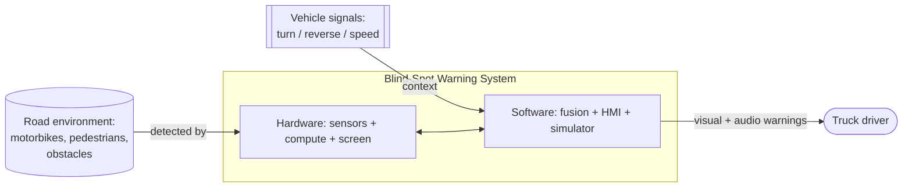
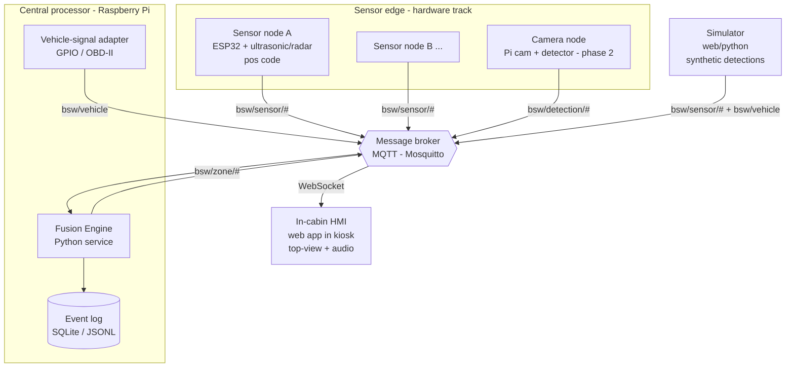
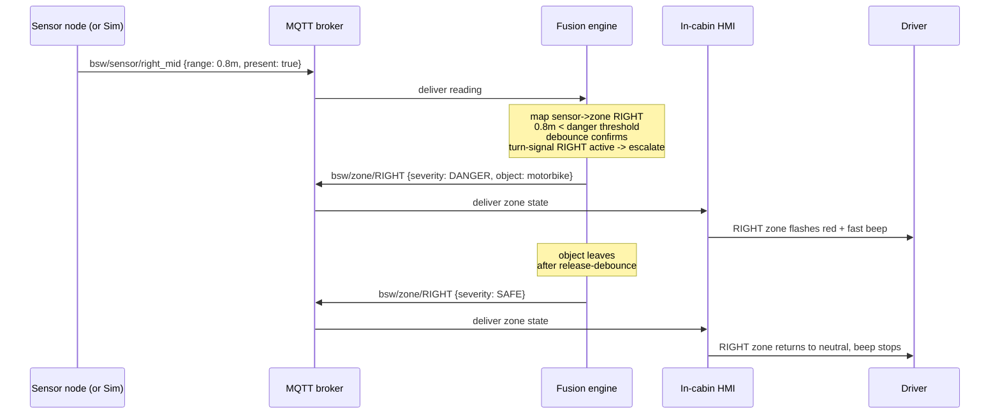
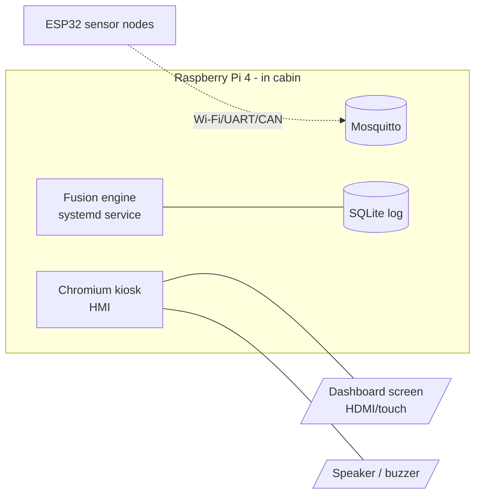

# 03 — System Architecture

## 3.1 Architectural principles

1. **Contract-first, bus-centric.** Components never call each other directly. They
   exchange messages on a common broker using documented contracts
   ([`04-message-protocol.md`](04-message-protocol.md)). This decouples the team's work
   and makes every component independently testable and replaceable.
2. **Sim/real parity.** Real sensors and the simulator publish *identical* messages.
   Everything downstream is unaware of the source. ([ADR-0005](adr/ADR-0005-sim-real-parity.md))
3. **Configuration over code.** Sensor count/position and zone mapping are JSON, honoring
   the proposal's "modular sensor placement" novelty (FR-02, FR-03).
4. **Fail loud, not silent.** A lost sensor becomes a visible `UNKNOWN`, never a fake `SAFE`
   (NFR-04).
5. **Advisory, not actuating.** BSW informs the driver; it never brakes or steers. This
   bounds complexity, cost, and liability for a cấp trường project.

## 3.2 Context (C4 level 1)



This repo owns the **SW** box; the **HW** box is the parallel hardware track and is
represented in software by an *input adapter* and a message contract.

## 3.3 Container view (C4 level 2)



**Key point:** `SIM` and the real `Edge` nodes are interchangeable producers on the same
topics. The `FUSE` and `HMI` containers do not know or care which is connected.

## 3.4 Components and responsibilities

### Sensor node (firmware — interface defined here, built by HW track)
- Sample its detector (ultrasonic / radar / IR) at ≥10 Hz.
- Publish `bsw/sensor/{sensor_id}` with range/presence + position code + health.
- Stateless about zones; the *mapping* lives centrally so layout stays reconfigurable.
- Reference behavior and the message it must emit: [`04-message-protocol.md`](04-message-protocol.md).

### Fusion Engine (Python service on the Pi) — the "bộ xử lý trung tâm"
- Subscribe to all `bsw/sensor/#` and `bsw/detection/#` and `bsw/vehicle`.
- Resolve each sensor → zone via [`config/sensors.example.json`](../config/sensors.example.json).
- Compute per-zone severity with thresholds + **debounce/hysteresis** (FR-09).
- Apply **context-aware** modifiers from vehicle signals (FR-08).
- Detect stale/missing sensors → emit `UNKNOWN` (FR-14 / NFR-04).
- Publish consolidated `bsw/zone/{zone_id}` state at a fixed cadence.
- Append events to the log (FR-10).
- Internals & state machine: [`05-warning-logic.md`](05-warning-logic.md).

### HMI (web app, Chromium kiosk on the Pi display)
- Subscribe to `bsw/zone/#` over MQTT-WebSockets.
- Render the top-view truck, color zones, place object icons (FR-05/06).
- Drive the audio alert engine by the worst active severity (FR-07).
- Show sensor faults and a settings/calibration view (FR-12/14).
- Spec: [`06-hmi-design.md`](06-hmi-design.md).

### Simulator
- A scene editor where you place objects around the truck; it emits the same
  `bsw/sensor/#` and `bsw/vehicle` messages a real rig would (FR-13).
- Doubles as the proposal's "computer simulation model" deliverable.
- Spec: [`08-simulation.md`](08-simulation.md).

### Message broker (Mosquitto)
- Lightweight MQTT broker on the Pi; also serves MQTT-over-WebSocket for the HMI.
- The single integration seam. Rationale: [ADR-0002](adr/ADR-0002-message-bus.md).

## 3.5 End-to-end data flow (sequence)



Latency budget (NFR-01), **split by path** per [ADR-0007](adr/ADR-0007-sensor-firing-schedule.md):
- **Danger-path** (range well inside `danger_m`, `confirm=1`): sensor sample+publish (~30 ms)
  → broker (~5 ms) → fusion immediate escalate (~10 ms) → broker (~5 ms) → HMI render+audio
  (~30 ms) ≈ **80–150 ms**.
- **Boundary-path** (near threshold, `confirm=2`): add one ultrasonic sample period — at
  ~5 Hz/sensor that is ~200 ms — so worst case ≈ **200–250 ms**. Deep danger uses `confirm=1`
  precisely so only boundary chatter pays the full debounce; the earlier "~50–100 ms debounce"
  estimate understated this because it ignored the second-sample wait.

## 3.6 Deployment view



- **Dev mode:** the entire stack (broker, fusion, HMI, simulator) runs on a laptop via
  Docker Compose — no hardware needed.
- **Bench/vehicle mode:** same images on the Pi; ESP32 nodes feed real readings.
- **Liveness ([ADR-0006](adr/ADR-0006-fail-loud-compute-liveness.md)):** a hardware watchdog
  reboots a wedged Pi, and the HMI's freshness clock degrades the map to UNKNOWN if the fusion
  heartbeat / zone stream stalls — converting the frozen-green failure mode into a visible fault.

## 3.7 Repository structure

```
truck-blindspot-ai/
├── docs/                      # this documentation set
├── config/                    # zones.example.json, sensors.example.json, thresholds
├── schemas/                   # JSON Schemas (contract source of truth)
├── services/
│   ├── fusion-engine/         # Python: subscribe sensors -> publish zones
│   └── vehicle-adapter/       # Python: GPIO/OBD -> bsw/vehicle (optional)
├── apps/
│   ├── hmi/                   # web app (vanilla TS + Vite + Canvas), kiosk
│   └── simulator/             # scene editor -> synthetic messages
├── firmware/
│   └── sensor-node-esp32/     # reference firmware (HW track collaboration)
├── sim/                       # geometric model + scenarios + deterministic runner
├── tests/                     # contract + scenario + integration suites (L1-L3)
├── deploy/
│   ├── docker-compose.yml     # dev: broker + fusion + hmi + sim
│   └── mosquitto/             # broker config + ACL template (22 security-hardening)
└── tools/                     # log replay, eval scripts, scenario runner
```

This layout follows the container view: one folder per deployable, contracts shared at
the root — and is the repository's current layout.

## 3.8 Cross-cutting concerns

| Concern | Approach |
|---------|----------|
| **Time** | Messages carry `ts` + `ts_kind` (the *producer's* clock). Consumers compute staleness/age from their **own local arrival time**, never by subtracting a foreign node's `ts` — RTC-less MCUs send `monotonic_ms`, and a pre-NTP Pi's `epoch_ms` is unreliable at boot. [ADR-0008](adr/ADR-0008-time-and-clock-domains.md). |
| **Config reload** | Fusion watches config files; zone/threshold edits apply without restart where safe. |
| **Logging** | Structured JSONL + SQLite for events; replayable through `tools/` for the eval report. |
| **Security** | Local-only broker on the prototype; for a vehicle pilot, enable MQTT auth/TLS (noted, deferred). |
| **Internationalization** | HMI labels are icon-first; text strings externalized (VI default, EN available). |
| **Testing** | Contract tests against `schemas/`; scenario replays (S1–S6) as regression tests. |
