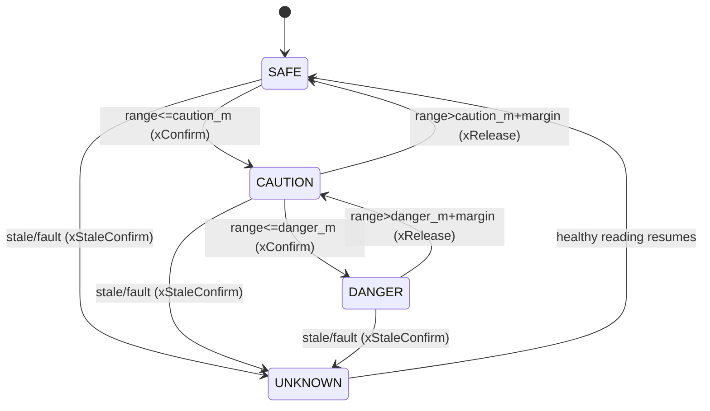

# 05 — Zone Model & Warning Logic

This is the heart of the "bộ xử lý trung tâm": how raw detections become a stable,
trustworthy, *spatial* warning. The logic lives in the Fusion Engine.

## 5.1 Zone model

The truck top-view is divided into 8 default zones. The active set and their geometry are
config-driven ([`../config/zones.example.json`](../config/zones.example.json)).

```
                 FRONT
        ┌───────────────────────┐
 FRONT_LEFT │                 │ FRONT_RIGHT
        │      ▓▓ TRUCK ▓▓     │
   LEFT │      ▓▓ (cab) ▓▓     │ RIGHT   ← highest risk (right-hand traffic)
        │      ▓▓▓▓▓▓▓▓▓▓     │
 REAR_LEFT  │                 │ REAR_RIGHT
        └───────────────────────┘
                  REAR
```

Each zone has, in [`zones.example.json`](../config/zones.example.json):
- `enabled` (bool)
- `risk_weight` (relative priority; `RIGHT`/`FRONT_RIGHT` default highest for Vietnam)
- `caution_m`, `danger_m` (distance thresholds)
- `polygon_norm` (top-view geometry for the HMI)

The **sensor→zone mapping is single-sourced** in
[`sensors.example.json`](../config/sensors.example.json): each sensor declares the one `zone`
it feeds (FR-02). The fusion engine builds the reverse index — zone → its contributing
sensor(s) — at load, so a zone may be fed by one or more sensors **without** the zone config
restating them. (Earlier drafts also listed `sensor_ids` on the zone; that duplicated the
mapping and was removed — the sensor's `zone` field is authoritative.)

## 5.2 Severity computation (per zone, per tick)

For each zone the engine gathers all contributing readings and computes:

```
present = healthy sensors in the zone with present=true
nearest = min(range_m over present)        # +inf if present is empty

if   no healthy sensor reporting           -> UNKNOWN  (stale/fault, NFR-04)
elif present is empty (all healthy, clear) -> SAFE      (nearest = +inf)
elif nearest <= danger_m                    -> DANGER
elif nearest <= caution_m                   -> CAUTION
else                                        -> SAFE
```

**Multiple sensors in one zone (precedence).** When a zone is fed by more than one sensor
(the reverse index allows it): range is the **minimum** over present healthy sensors (nearest
wins); `object_class` comes from the **camera detection** if any is present (ultrasonic
carries no class), else `unknown`; the zone is `UNKNOWN` only if **every** contributing sensor
is stale/fault. Camera classifies, ultrasonic ranges ([ADR-0004](adr/ADR-0004-sensor-modality.md)).

A **camera detection** (`bsw/detection`) can raise severity and sets `object_class`. A VRU
(`pedestrian`/`cyclist`/`motorbike`) gets a **wider** effective threshold than a generic
vehicle — it escalates *sooner*, farther out — because VRUs are more vulnerable and less
predictable (the multiplier convention is in §5.4).

## 5.3 Debounce / hysteresis (FR-09)

Naive thresholding flickers when an object hovers at the boundary, or when ultrasonic
readings are noisy. Two mechanisms:

1. **Confirm / release counters.** A zone must see N consecutive worse readings to escalate
   and M consecutive better readings to de-escalate. Defaults: `confirm = 2`, `release = 4`
   (slower to clear than to warn — bias toward safety). **Confirm-by-range
   ([ADR-0007](adr/ADR-0007-sensor-firing-schedule.md)):** when a reading is *well inside*
   `danger_m` (deep, unambiguous danger) the zone escalates **immediately** (`confirm = 1`);
   `confirm = 2` applies only near the boundary. "Well inside" is quantified by
   **`immediate_danger_factor`** (default `0.6`): escalate immediately when
   `range_m ≤ immediate_danger_factor × danger_m` (e.g. ≤ 0.48 m for a 0.8 m zone). This keeps
   the danger-path inside the NFR-01 latency budget despite the lower (~5 Hz) per-sensor
   ultrasonic rate under group-firing.
2. **Asymmetric distance hysteresis.** Entering DANGER at `danger_m`, but only leaving it
   above `danger_m + margin` (default margin 0.2 m). Prevents boundary chatter.
3. **Stale debounce (anti-flicker for UNKNOWN).** A single late/dropped reading must not flip
   a zone to UNKNOWN and fire the fault chime. A zone enters UNKNOWN only after no fresh
   healthy reading for `stale_after_ms` **and** `stale_confirm` consecutive missed sample
   windows (default `stale_confirm = 2`); the one-shot fault chime is **rate-limited**
   (`fault_chime_min_interval_ms`, default 10 s per zone) so Wi-Fi jitter inside a metal body
   ([ADR-0002](adr/ADR-0002-message-bus.md)) cannot nag. Set `stale_after_ms` to **≥ 3× the
   slowest expected sample period** (~600 ms for 5 Hz ultrasonic; the example uses 700 ms).



## 5.4 Context-aware modifiers (FR-08) — the anti-alert-fatigue layer

A system that screams about every zone all the time gets switched off. BSW uses
`bsw/vehicle` context to focus attention. Rules (config-tunable):

**Threshold-scaling convention (normative).** "Boost", VRU weighting, and every multiplier in
[`zones.example.json`](../config/zones.example.json) scale the trigger *distance*:
`effective_threshold_m = base_threshold_m × factor`. A factor **> 1 widens** the trigger
distance, so the zone reaches CAUTION/DANGER **farther out and sooner** (more sensitive); a
factor **< 1** narrows it. (E.g. `danger_m 0.8 × turn-signal 1.3 = 1.04 m`, and
`× VRU 1.25 = 1.0 m` — both warn earlier.) "Boosted" therefore means a **larger** effective
threshold, not a smaller number. Factors compose by multiplication.

| Context | Effect |
|---------|--------|
| `turn_signal = right` | `RIGHT`, `FRONT_RIGHT`, `REAR_RIGHT` **boosted** (wider thresholds → earlier warning, full audio). The lethal right-turn case (S2). |
| `turn_signal = left` | Left-side zones boosted. |
| `turn_signal = hazard` | Treated as **both** sides boosted (all side zones) — used when stopped/obstructed. |
| `gear = reverse` | `REAR*` zones boosted; front zones de-emphasized to visual-only. |
| `speed ≤ low_max (~30 kph)` | Full low-speed sensitivity (maneuvering — the primary use case). |
| `low_max < speed < high_min` | Transition band: hold low-speed behavior (no abrupt change across the gap). |
| `speed ≥ high_min (~50 kph)` | Side zones relax toward lane-change relevance; very-near static returns suppressed (highway, not curb). |
| `gear = park` & stationary | **Standby**: keep visual map, suppress audio nagging when next to a wall/curb (S6). |
| no vehicle data | Safe default: monitor **all** zones at normal thresholds. |

Context only ever **reprioritizes**; a DANGER in an unboosted zone is still shown — it is
never fully hidden.

## 5.5 Audio policy (FR-07)

The HMI sounds the **single worst** active severity (don't layer beeps):

| Worst active severity | Sound |
|-----------------------|-------|
| SAFE / UNKNOWN-only | silent (UNKNOWN shows visually + a one-shot chime on first fault) |
| CAUTION | slow intermittent beep (~1–2 Hz) |
| DANGER | fast beep / continuous tone (~4–8 Hz) |

`mute` command silences audio for a timeout but never hides the visual state.

## 5.6 Multi-object & priority

When several zones are active, the HMI shows them all, but audio + the "primary alert"
banner follow the highest `risk_weight × severity` product, so the driver's ear is guided
to the most dangerous zone first.

## 5.7 Worked examples (map to scenarios in `02-requirements.md`)

- **S2 Right turn, motorbike at 0.8 m on RIGHT, signal=right:** boosted thresholds + VRU
  weighting → fast escalation to DANGER, red `RIGHT` zone, fast beep. Target: warn within
  ≤200 ms of the bike entering the zone.
- **S4 Reversing, pallet at 0.5 m REAR:** reverse boosts rear zones → DANGER on `REAR`,
  continuous tone.
- **S6 Parked by a wall on LEFT:** `gear=park`, stationary → standby; `LEFT` shows amber
  visually but audio stays silent. No nagging.
- **Sensor unplugged on RIGHT:** readings go stale → `RIGHT` = UNKNOWN (hatched/grey on
  HMI) + one-shot fault chime. Never silently "safe".

## 5.8 Tunables (live in `config/`)

`confirm`, `release`, `margin_m`, `immediate_danger_factor`, `stale_after_ms`, `stale_confirm`,
`fault_chime_min_interval_ms`, per-zone `caution_m`/`danger_m`, `risk_weight`,
VRU threshold multiplier, speed bands, audio frequencies, mute timeout. All adjustable via
`bsw/cmd/...` during evaluation to find the false-alarm/sensitivity sweet spot (NFR-09).
