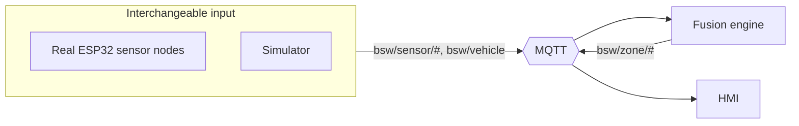

# 08 — Simulator & Sim/Real Parity

The simulator is both a **development tool** and a **proposal deliverable** ("mô hình mô
phỏng trên máy tính"). It lets the team build and demo the *entire* warning experience
before any sensor is mounted.

## 8.1 The core idea (parity)

The fusion engine and HMI consume **messages**, not hardware. So anything that publishes
the same `bsw/sensor/#` and `bsw/vehicle` messages is, to the rest of the system,
indistinguishable from a real rig.

Switching from simulation (deployment A) to bench hardware (deployment B) means **changing
the producer, nothing else** ([ADR-0005](adr/ADR-0005-sim-real-parity.md)).

## 8.2 What the simulator provides

1. **Scene editor** — a top-view canvas where you place/drag objects (motorbike,
   pedestrian, car, static obstacle) around the truck and set their speed/heading.
2. **Sensor emulation** — for each configured sensor (from [`../config/sensors.example.json`](../config/sensors.example.json)),
   compute whether an object falls in its field and at what range, then publish a realistic
   `bsw.sensor_reading` — optionally with **noise, dropout, and latency** to stress-test
   the debounce logic.
3. **Vehicle control** — toggles for turn signal, gear, reverse, and a speed slider →
   `bsw.vehicle`, to exercise context-aware rules (FR-08).
4. **Scenario playback** — load scripted scenarios S1–S6 (from [`02-requirements.md`](02-requirements.md))
   and replay them deterministically for demos and regression tests.

## 8.3 Fault & edge-case injection

To validate NFR-04 / FR-09 the simulator can:
- Drop a sensor (stop publishing) → expect zone → `UNKNOWN`.
- Inject boundary jitter → expect debounce to hold steady (no flicker).
- Flood multiple zones → expect correct priority/audio (one worst severity).
- Send a VRU vs a vehicle at the same range → expect different effective severity.

## 8.4 Implementation options

| Option | Pros | Use when |
|--------|------|----------|
| **Web simulator** (vanilla TS, shares HMI's canvas code) | Visual, draggable, demo-friendly, no install | Demos, UX work, teaching |
| **Python scenario runner** (`tools/`) | Scriptable, CI-friendly, deterministic | Automated regression tests, eval data generation |

Recommend building both: the web sim for people, the Python runner for tests. They emit
the same messages.

## 8.5 Role in the project plan

- **Phases 2–4** (design, signal logic, HMI): develop entirely against the simulator.
- **Phase 4–5**: bring up real ESP32 nodes; because of parity, only the producer changes —
  fusion + HMI are already proven.
- **Phase 6 / evaluation**: replay recorded real-sensor logs through the same pipeline
  (`tools/` log replay) to produce repeatable feasibility evidence (FR-10).
